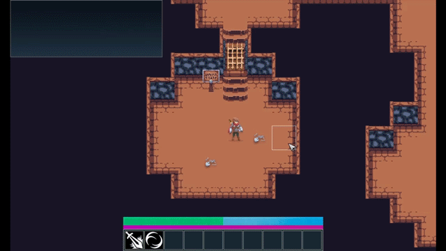

# Castlelike

Roguelike game engine with GUI (C++/SDL2)

## Teaser

## Features

* custom simple ECS;
* event bus for managing events;
* application states (menu, game, loading);
* custom GUI framework written from scratch;
* simple blocking resource manager;
* support for simplistic cutscenes (movement is one);
* simple dialogue system;
* save/load (serialization/deserialization) system;
* loot/equipment/fighting/...

## Build

Open solution file (Solution folder) and build with Visual Studio 2019.

## Run

Run through Visual Studio or built exe.
Game engine offers one demo level showing some capabilities of engine.

## Libraries license information

Castlelike is licensed under GPLv2. See [licence.txt](LICENSE.txt) for the full text.  

Castlelike uses the following open source packages:  

* SDL2 ([license](Documents/SDL2_license.txt)).
* SDL2_image ([license](Documents/SDL2_image_license.txt)).
* SDL2_ttf ([license](Documents/SDL2_ttf_license.txt)).
* JSON for Modern C++ ([license](Documents/nlohmann_json_license.txt)).
* zlib ([license](Documents/zlib_license.txt)).
* pugixml ([license](Documents/Pugixml_license.txt)).
* libfreetype ([license](Documents/libfreetype_license.txt)).
* libpng ([license](Documents/libpng_license.txt)).

## Assets license information

Skill icons (Available on https://game-icons.net):

* Pointy sword icon by Lorc under CC BY 3.0
* Spinning sword icon by Lorc under CC BY 3.0
* Saber slash icon by Lorc under CC BY 3.0
* Bull horns icon by Lorc under CC BY 3.0
* Footsteps icon by Skoll under CC BY 3.0
* Circle claws icon by Lorc under CC BY 3.0

Main hero sprites based on Animated Pixel Adventurer by rvros (Available on https://rvros.itch.io/animated-pixel-hero).

Enemy sprites based on Monsters Creatures Fantasy by luizmelo under CC0 (Available on https://luizmelo.itch.io/monsters-creatures-fantasy).

Tileset is Dungeon Tileset by stealthix under CC0 (Available on https://stealthix.itch.io/dungeon-tileset-32x32-px).

Some objects are based on Dungeon Assets by stealthix under CC0 (Available on https://stealthix.itch.io/dungeon-tileset-32x32-px).

Item icons based on 420 -Pixel Art- Icons for RPG by 7Soul1 under CC BY 3.0 (Available on https://www.deviantart.com/7soul1/art/420-Pixel-Art-Icons-for-RPG-129892453).

Lato font by Łukasz Dziedzic under SIL Open Font License, Version 1.1.
